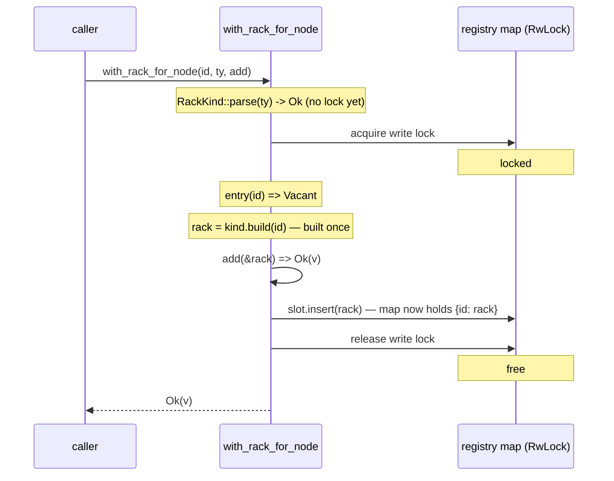
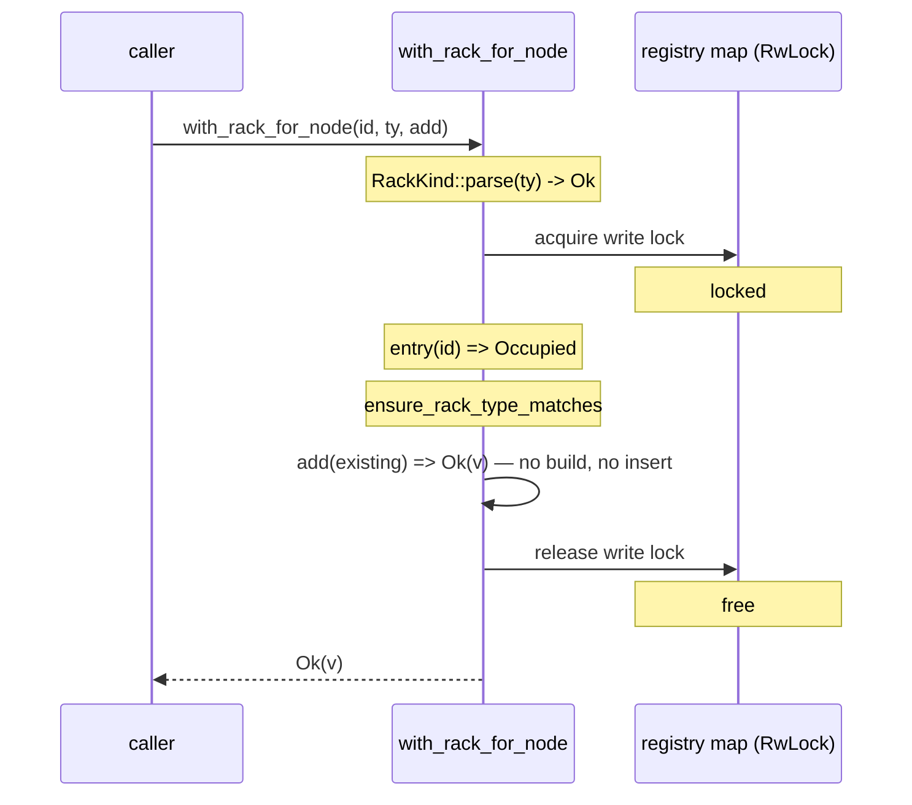
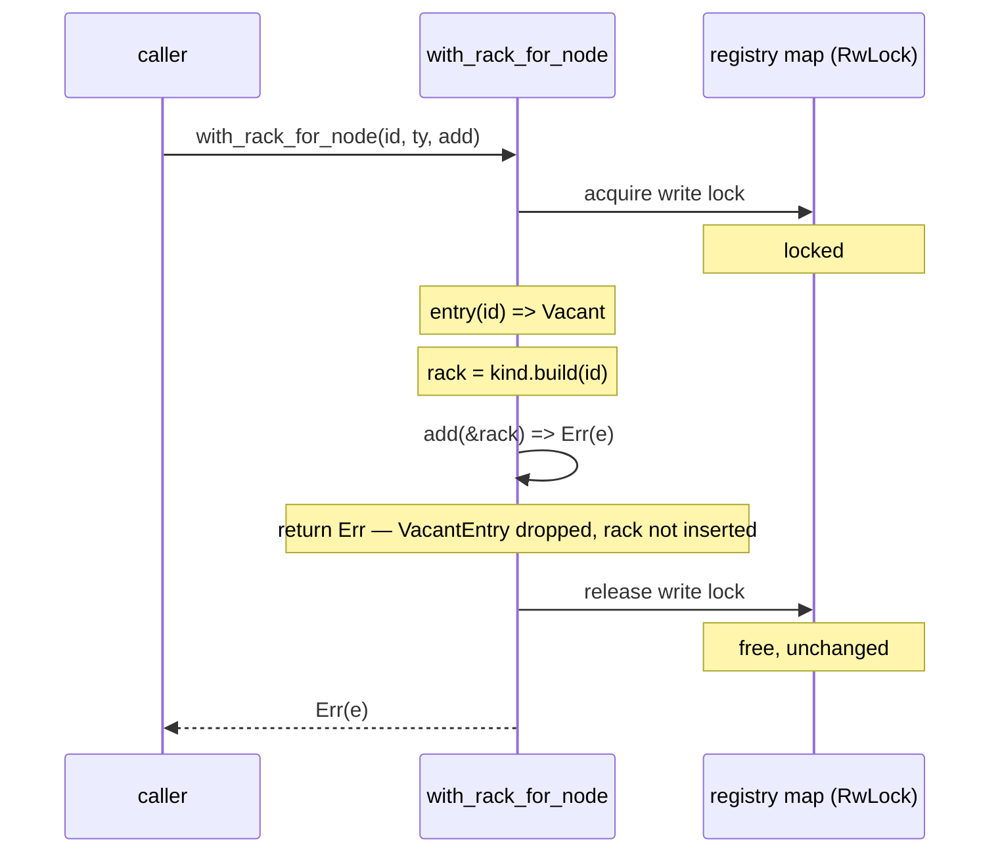
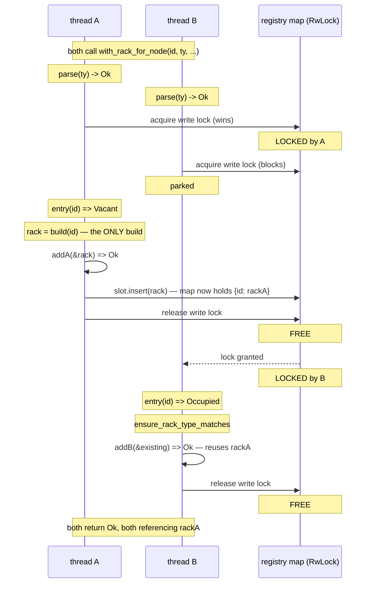
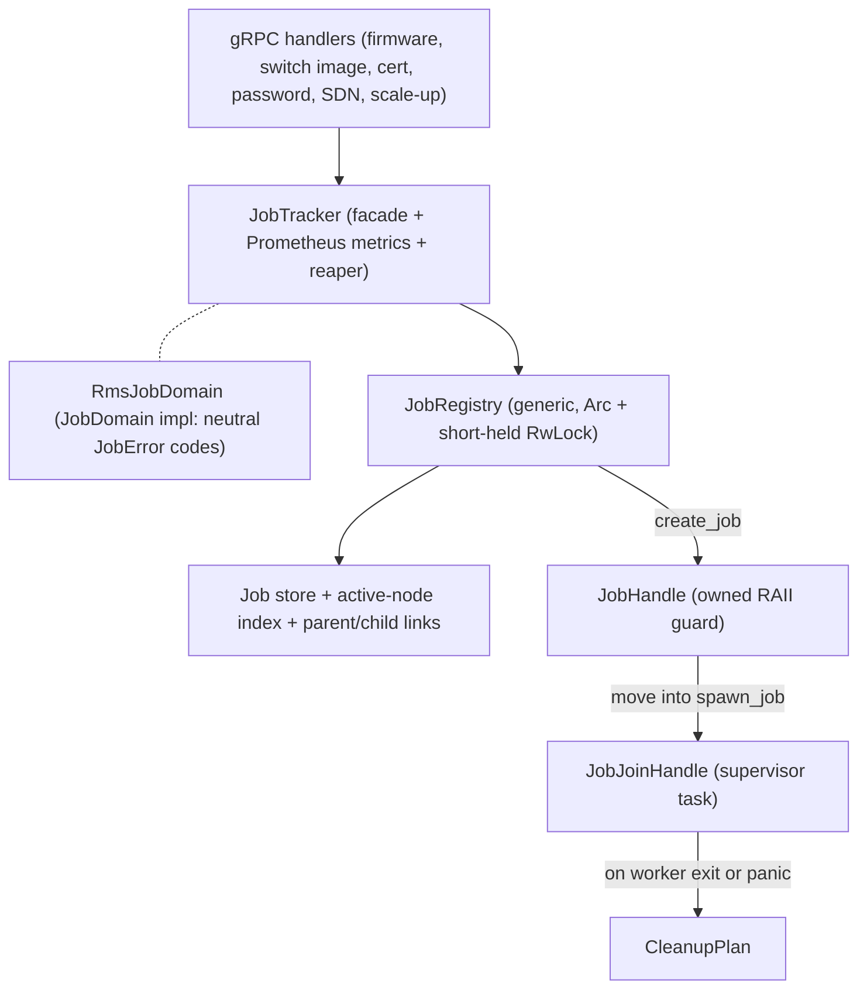
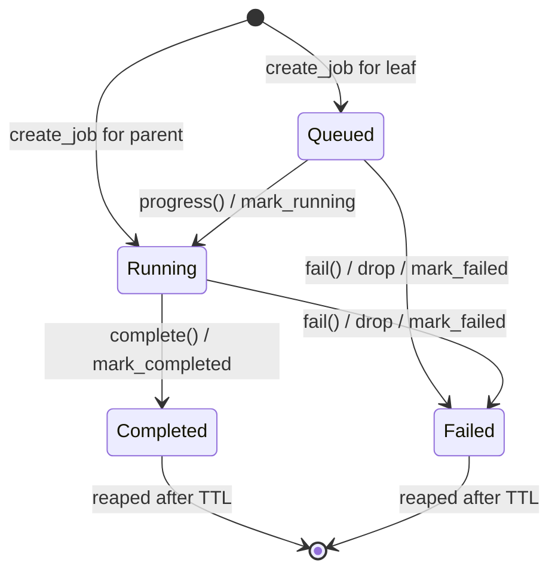
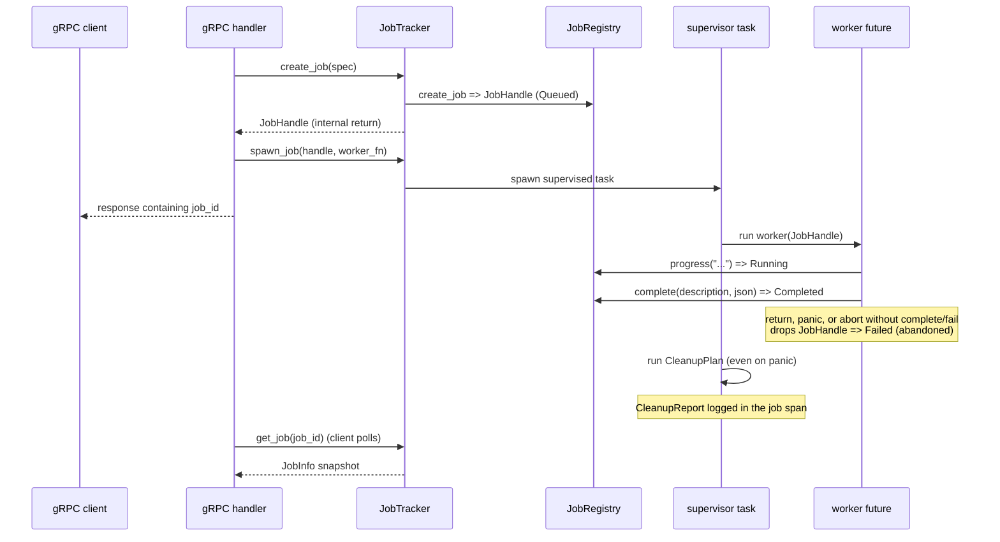

# RMS orchestrator

The orchestrator is the single entry point for RMS business logic. It owns two
long-lived concerns:

- **The rack registry** (`RackManager`) — the in-memory map of managed racks.
- **Asynchronous job tracking** (`job_lifecycle` + `job_tracker`) — the machinery
  that runs long operations (firmware updates, switch image/certificate/password
  updates, SDN factory-default resets, scale-up fabric configuration) as
  background jobs that clients start and then poll for status.

This document collects the diagrams and design notes that are too large to keep
inline in the source doc comments.

## RackManager registry locking

The `RackManager` owns the rack registry — a `RwLock<HashMap<String, Arc<ManagedRack>>>`.

### `with_rack_for_node`

`with_rack_for_node(rack_id, rack_type, add)` looks up (or lazily creates) the
rack for `rack_id` and runs the `add` closure against it, atomically under the
registry write lock.

- `add` receives the canonical rack: the already-registered instance when one
  exists, otherwise a freshly built rack.
- A newly built rack is inserted only after `add` succeeds, so a failed `add`
  never leaves an empty rack behind.
- The rack is constructed lazily inside the write lock and only on the vacant
  branch, so no instance is ever built speculatively and discarded on a race.
  Concurrent creators of the same new `rack_id` all converge on the single
  instance built by the winner.

Validation is split from construction so the only fallible step
(`RackKind::parse`) runs before the lock, while `RackKind::build` is infallible
and runs only on the insert path.

#### New rack, `add` succeeds

The rack is built exactly once, then inserted.

#### Existing rack

The registered instance is reused in place — never rebuilt, never re-inserted.

#### New rack, `add` fails

Nothing is persisted: the `VacantEntry` is dropped and the rack is never
inserted.

#### Concurrent creators of the same new rack

The write lock serializes the two threads, so exactly one takes the `Vacant`
arm and the other finds `Occupied` and reuses that instance. Only thread A ever
calls `build`.

Because `build` runs only inside the `Vacant` arm while the write lock is held,
thread B never constructs a second rack to discard — contrast a
build-before-lock design, where B would build `rackB` and throw it away after
losing the race.

## Job tracking model

Long RMS operations do not block their initiating RPC. A gRPC handler validates
the request, starts a job, and immediately returns a job ID; the client then
polls `GetJobStatus` (or a legacy per-workflow status RPC) until the job reaches
a terminal state. Work runs on a supervised Tokio task, and the job record lives
in an in-memory registry.

The model is split into two layers so the tricky lifecycle mechanics are written
once and reused by every workflow:

- **`job_lifecycle`** — generic, domain-agnostic primitives, parameterized over a
  `JobDomain`. It owns the registry, the RAII guards, the supervisor, and
  cleanup.
- **`job_tracker`** — the RMS-specific facade. `JobTracker` is what handlers call;
  `RmsJobDomain` plugs RMS's neutral error codes (`JobError`) and fallback
  messages into the generic layer, and the tracker adds Prometheus metrics and a
  TTL reaper.

### Layers

### Key components

- **`JobRegistry<D>`** — the `Arc`-shared store behind a short-held `RwLock`.
  Guards are never held across `.await`; async work clones what it needs, drops
  the lock, then awaits. Enforces a capacity cap (`MAX_TRACKED_JOBS`, 10,000) and
  a terminal-job TTL.
- **`JobDomain`** — trait supplying the failure constructors the generic layer
  needs (`dropped_failure`, `at_capacity_failure`,
  `node_busy_failure`, `shutting_down_failure`,
  `parent_unavailable_failure`).
  `RmsJobDomain` is the single implementation shared by all RMS workflows.
- **`JobSpec`** — creation input for queued node jobs and running top-level
  jobs (rack/node IDs, initial description, tracing span, optional `JobType`).
- **`JobHandle`** — the owned RAII guard returned for every created job.
  Workflows move it into the task that owns the work. `progress`, `complete`,
  and `fail` transition state; dropping it while still non-terminal marks the
  job failed as abandoned via `dropped_failure`.
- **`JobJoinHandle`** — `#[must_use]` supervisor handle. `wait()` observes the
  final state and cleanup; `detach()` lets fire-and-forget handlers continue while
  the supervisor still runs cleanup.
- **`CleanupPlan` / `CleanupReport`** — post-worker cleanup (e.g. removing a
  temporary artifact directory), run in a supervised, span-instrumented task even
  when the worker panics. Reports one of `Skipped`, `Removed`, `Failed`, or
  `Panicked`.
- **`JobType`** — externally visible workflow classification used for spans and
  metrics: `FirmwareUpdate`, `SwitchCertificate`, `SwitchMtlsDisable`, `SwitchSdnFactoryDefaultReset`,
  `SwitchSystemPasswordUpdate`, `SwitchSystemImageUpdate`,
  `ConfigureScaleUpFabricManagerV2`.
- **`JobError`** — domain-neutral failure classification (internal, timeout,
  client/server error, unauthenticated, target/file not found, ...). `conversions`
  maps it to the protobuf error enums for the status RPCs.

### Job states

Leaf jobs start `Queued`; parent jobs are created already `Running`. `Completed`
and `Failed` are terminal and final for ordinary transitions. Consuming the
handle with `complete` or `fail` prevents its destructor from recording an
abandoned failure.

### Job lifecycle: spawn to cleanup

### Parent/child jobs and admission control

- **Batch (parent) jobs.** A parent aggregates several child leaf jobs so a batch
  request (e.g. update firmware on many nodes) has one status handle. A child may
  belong to at most one parent; the parent's status is derived from its children.
- **Node-idle admission.** `create_job_if_node_idle` (backed by
  `JobRegistry::create_job`) admits a job only when no other active job targets
  the same `rack_id` / `node_id`, using an active-node index over queued and
  running leaf jobs. This serializes mutating operations per node. Cancellation
  keeps the node busy until the job actually transitions to a terminal state.
- **Capacity and retention.** New jobs are refused with an at-capacity failure
  once the registry is full. Terminal records are retained for the configured TTL
  (so late pollers still see the result) and then removed — by admission-time
  pruning under capacity pressure and by the background reaper started with
  `spawn_reaper`.
- **Shutdown.** After `begin_shutdown`, the registry refuses new jobs with a
  shutting-down failure while letting in-flight work drain.

### Locking, cancellation, and observability

- **Locking.** Registry methods take short synchronous `RwLock` guards and never
  hold them across `.await`. A poisoned lock is recovered rather than propagated.
- **Cancellation.** Each job carries a `CancellationToken`; `cancel` signals it,
  but the node stays busy until the worker records a terminal (cancelled) state.
- **Observability.** Every job runs inside its own tracing span, so worker logs,
  cleanup panics, and leaked resources are all attributable to a `job_id`.
  `JobType` drives per-workflow Prometheus counters and gauges.
