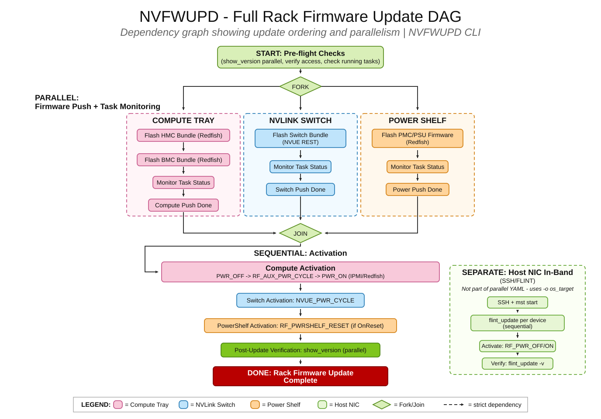

Simultaneously Updating the Firmware for Separate Rack Trays
----------------------------------------------------------------------------

NVFWUPD v2.0.5 and later supports the ability to update separate server rack trays simultaneously.

Updating Multiple Systems Across a Rack with ParallelThreadCount
~~~~~~~~~~~~~~~~~~~~~~~~~~~~~~~~~~~~~~~~~~~~~~~~~~~~~~~~~~~~~~~~~~~~~~

NVFWUPD v2.1.1 and later provides customizable parallel operation performance, using the ``ParallelThreadCount`` parameter.

When pushing packages to systems across a rack, use the ``ParallelThreadCount`` parameter to set the maximum number of threads for parallel operations.

The default thread count is 10. You can override it based on the host system's capabilities and how many systems you update at the same time.

Example configuration:

.. code-block::

    ParallelUpdate: true
    ParallelThreadCount: 25
    Targets:
          - BMC_IP: "192.0.2.10"
            RF_USERNAME: "username"
            RF_PASSWORD: "<password>"
            TARGET_PLATFORM: 'GB200'
            PACKAGE: ["BMC_package.fwpkg"]
            UPDATE_PARAMETERS_TARGETS: {"Targets": [], "ForceUpdate": true}
            SYSTEM_NAME: "Compute Tray 1"
          - BMC_IP: "198.51.100.10"
            RF_USERNAME: "username"
            RF_PASSWORD: "<password>"
            TARGET_PLATFORM: 'GB200'
            PACKAGE: ["BMC_package.fwpkg"]
            UPDATE_PARAMETERS_TARGETS: {"Targets": [], "ForceUpdate": true}
            SYSTEM_NAME: "Compute Tray 2"
          - BMC_IP: "203.0.113.10"
            RF_USERNAME: "username"
            RF_PASSWORD: "<password>"
            TARGET_PLATFORM: 'GB200'
            PACKAGE: ["BMC_package.fwpkg"]
            UPDATE_PARAMETERS_TARGETS: {"Targets": [], "ForceUpdate": true}
            SYSTEM_NAME: "Compute Tray 3"
          - BMC_IP: "192.0.2.11"
            RF_USERNAME: "username"
            RF_PASSWORD: "<password>"
            TARGET_PLATFORM: 'GB200'
            PACKAGE: ["BMC_package.fwpkg"]
            UPDATE_PARAMETERS_TARGETS: {"Targets": [], "ForceUpdate": true}
            SYSTEM_NAME: "Compute Tray 4"
          - BMC_IP: "198.51.100.11"
            RF_USERNAME: "username"
            RF_PASSWORD: "<password>"
            TARGET_PLATFORM: 'GB200'
            PACKAGE: ["BMC_package.fwpkg"]
            UPDATE_PARAMETERS_TARGETS: {"Targets": [], "ForceUpdate": true}
            SYSTEM_NAME: "Compute Tray 5"
          - BMC_IP: "203.0.113.11"
            RF_USERNAME: "username"
            RF_PASSWORD: "<password>"
            TARGET_PLATFORM: 'GB200'
            PACKAGE: ["BMC_package.fwpkg"]
            UPDATE_PARAMETERS_TARGETS: {"Targets": [], "ForceUpdate": true}
            SYSTEM_NAME: "Compute Tray 6"
          - BMC_IP: "192.0.2.12"
            RF_USERNAME: "username"
            RF_PASSWORD: "<password>"
            TARGET_PLATFORM: 'GB200'
            PACKAGE: ["BMC_package.fwpkg"]
            UPDATE_PARAMETERS_TARGETS: {"Targets": [], "ForceUpdate": true}
            SYSTEM_NAME: "Compute Tray 7"
          - BMC_IP: "198.51.100.12"
            RF_USERNAME: "username"
            RF_PASSWORD: "<password>"
            TARGET_PLATFORM: 'GB200'
            PACKAGE: ["BMC_package.fwpkg"]
            UPDATE_PARAMETERS_TARGETS: {"Targets": [], "ForceUpdate": true}
            SYSTEM_NAME: "Compute Tray 8"

Higher thread counts are advantageous when updating many systems across one or more racks simultaneously. Each thread handles one system independently.

Updating Multiple Packages on the Same System with UPDATE_DELAY
~~~~~~~~~~~~~~~~~~~~~~~~~~~~~~~~~~~~~~~~~~~~~~~~~~~~~~~~~~~~~~~

NVFWUPD v2.0.9 and later supports updating multiple compute packages to the same system simultaneously, using the ``UPDATE_DELAY`` parameter.

When pushing multiple packages to the same system (for example, HMC and BMC), use the ``UPDATE_DELAY`` parameter to add a delay in seconds between package pushes.
Push the HMC package first, followed by the BMC package. This prevents BMC memory exhaustion.
Using this method enables you to update the BMC and HMC for the same system simultaneously.

Example configuration:

.. code-block::

    ParallelUpdate: true
    Targets:
          - BMC_IP: "192.0.2.10"
            RF_USERNAME: "username"
            RF_PASSWORD: "<password>"
            TARGET_PLATFORM: 'GB200'
            PACKAGE: ["HMC_package.fwpkg"]
            SYSTEM_NAME: "GB200 System with HMC"
            UPDATE_PARAMETERS_TARGETS: {"Targets": ["/redfish/v1/Chassis/HGX_Chassis_0"], "ForceUpdate": true}
          - BMC_IP: "192.0.2.10"
            RF_USERNAME: "username"
            RF_PASSWORD: "<password>"
            TARGET_PLATFORM: 'GB200'
            UPDATE_DELAY: 30
            PACKAGE: ["BMC_package.fwpkg"]
            UPDATE_PARAMETERS_TARGETS: {"Targets": [], "ForceUpdate": true}
            SYSTEM_NAME: "GB200 System with BMC"

In this example, the HMC package is pushed first, then nvfwupd waits 30 seconds before pushing the BMC package. Both tasks are monitored in parallel.
The beginning of the task output shows a message indicating the delay before the second package is pushed.

.. code-block::

    nvfwupd -c paralel_test_different_bmc.yaml update_fw
    Updating ip address: ip=XXXX
    Updating ip address: ip=XXXX
    FW package: ['UpdatePackages/nvfw_GB200-P4975_0009_251020.1.1_custom_dbg-signed.fwpkg']
    FW package: ['UpdatePackages/nvfw_GB200-P4972_0011_251013.1.0_custom_prod-signed.fwpkg']
    Waiting 30 seconds before beginning update with UpdatePackages/nvfw_GB200-P4972_0011_251013.1.0_custom_prod-signed.fwpkg
    {"@odata.id": "/redfish/v1/TaskService/Tasks/HGX_5", "@odata.type": "#Task.v1_4_3.Task", "Id": "HGX_5", "TaskState": "Running", "TaskStatus": "OK"}
    FW update started, Task Id: HGX_5
    ------------------------------------------------------------------------------------------------------------------------
    {"@odata.id": "/redfish/v1/TaskService/Tasks/0", "@odata.type": "#Task.v1_4_3.Task", "Id": "0", "TaskState": "Running", "TaskStatus": "OK"}
    FW update started, Task Id: 0
    ------------------------------------------------------------------------------------------------------------------------
    ...

Updating the GB200 NVL BMC Tray with the GB200 NVL Switch
~~~~~~~~~~~~~~~~~~~~~~~~~~~~~~~~~~~~~~~~~~~~~~~~~~~~~~~~~

To simultaneously update the firmware for a GB200 NVL BMC tray and GB200 NVL Switch:

1. Create a nvfwupd configuration yaml file that contains ``"ParallelUpdate": true``.

2. Create a list of Targets, one target for each tray of the rack, each of which contains ``BMC_IP``, ``RF_USERNAME``, ``RF_PASSWORD``, and ``PACKAGE`` as mandatory parameters.

    - For platforms that require ``servertype``, include ``TARGET_PLATFORM``.

    - Include ``UPDATE_PARAMETERS_TARGETS`` for each tray of the rack that requires a special json file to update.

Here is an example of a configuration file for rack server parallel update of the BMC and Switch trays:

.. code-block::

    $ cat bmc_switch_parallel_update_config.yaml

    # To enable parallel update in nvfwupd, set the ParallelUpdate key to true
    ParallelUpdate: true

    # When ParallelUpdate is enabled, "Targets" becomes a list of systems alongside their packages
    # BMC_IP, RF_USERNAME, RF_PASSWORD, PACKAGE are mandatory when using parallel update
    # TARGET_PLATFORM would be needed for any systems that would normally require it from the command line (that is: GB200, gb200switch, and so on)
    # UPDATE_PARAMETERS_TARGETS is optional, but uses the same exact params as the special target file for nvfwupd "-s" option in json format with a given system
    # SYSTEM_NAME is an entirely optional, but recommended user defined string. It is used to more easily distinguish systems as it is used in task printouts
    Targets: 
          - BMC_IP: "203.0.113.10"
            RF_USERNAME: "****" 
            RF_PASSWORD: "****" 
            TARGET_PLATFORM: 'gb200switch'
            PACKAGE: "nvfw_GB200-P4978_0004_241209.1.7_dbg-signed.fwpkg"
          - BMC_IP: "198.51.100.11"
            RF_USERNAME: "****" 
            RF_PASSWORD: "****" 
            TARGET_PLATFORM: 'GB200'
            PACKAGE: "nvfw_GB200-P4972_0004_240808.1.1_custom_prod-signed.fwpkg"
            UPDATE_PARAMETERS_TARGETS: {"Targets": [], "ForceUpdate": true}

3. Now the ``show_version`` command can be used to show the BMC and Switch tray versions in parallel (optional to add the ``-j`` flag to show output in JSON format):

.. code-block::

    $ nvfwupd -c bmc_switch_parallel_update_config.yaml show_version
    System Model: N5200_LD
    Part number: $TRAY_PART_NUMBER
    Serial number: $TRAY_SERIAL_NUMBER
    Packages: ['GB200-P4978_0004_241209.1.7']
    Connection Status: Successful

    Firmware Devices:
    AP Name            Sys Version           Pkg Version            Up-To-Date
    -------            -----------           -----------            ----------
    ASIC               35.2014.1610          N/A                    No        
    BIOS               0ACTV_00.01.010d      N/A                    No        
    BMC                88.0002.0600          88.0002.0600           Yes       
    CPLD1              CPLD000370_REV0300    N/A                    No        
    CPLD2              CPLD000377_REV0500    N/A                    No        
    CPLD3              CPLD000373_REV0205    N/A                    No        
    CPLD4              CPLD000390_REV0200    N/A                    No        
    EROT               01.04.0000.0000_n04   01.03.0235.0000_n04    Yes       
    EROT-ASIC1         01.04.0000.0000_n04   01.03.0235.0000_n04    Yes       
    EROT-ASIC2         01.04.0000.0000_n04   01.03.0235.0000_n04    Yes       
    EROT-BMC           01.04.0000.0000_n04   01.03.0235.0000_n04    Yes       
    EROT-CPU           01.04.0000.0000_n04   01.03.0235.0000_n04    Yes       
    EROT-FPGA          01.04.0000.0000_n04   01.03.0235.0000_n04    Yes       
    FPGA               0.1A                  0.19                   Yes       
    SSD                CE00A400              N/A                    No        
    transceiver        N/A                   N/A                    No        
    --------------------------------------------------------------------------
    System Model: GB200 NVL
    Part number: $TRAY_PART_NUMBER
    Serial number: $TRAY_SERIAL_NUMBER
    Packages: ['GB200-P4972_0004_240808.1.1_custom']
    Connection Status: Successful
    Firmware Devices:
    AP Name              Sys Version                 Pkg Version         Up-To-Date
    -------              -----------                 -----------         ---------
    FW_BMC_0             gb200nvl-24.08-2            GB200Nvl-24.08-2    Yes
    FW_CPLD_0            0.00                        N/A                 No
    FW_CPLD_1            0.00                        N/A                 No
    FW_CPLD_2            0.00                        N/A                 No
    FW_CPLD_3            0.00                        N/A                 No
    FW_ERoT_BMC_0        01.03.0183.0000_n04         01.03.0183.0000_n04 Yes
    NIC_0                28.98.9122                  N/A                 No
    UEFI                 buildbrain-gcid-37009178    N/A                 No
    HGX_FW_BMC_0         gb200nvl-24.08-2            N/A                 No
    HGX_FW_CPLD_0        0.112                       N/A                 No
    HGX_FW_CPU_0         02.02.02                    N/A                 No
    HGX_FW_CPU_1         02.02.02                    N/A                 No
    HGX_FW_ERoT_BMC_0    01.03.0183.0000_n04         N/A                 No
    HGX_FW_ERoT_CPU_0    01.03.0183.0000_n04         N/A                 No
    HGX_FW_ERoT_CPU_1    01.03.0183.0000_n04         N/A                 No
    HGX_FW_ERoT_FPGA_0   01.03.0183.0000_n04         N/A                 No
    HGX_FW_ERoT_FPGA_1   01.03.0183.0000_n04         N/A                 No
    HGX_FW_FPGA_0        312e3041                    N/A                 No
    HGX_FW_FPGA_1        312e3041                    N/A                 No
    HGX_FW_GPU_0         97.00.0c.00.00              N/A                 No
    HGX_FW_GPU_1         97.00.0c.00.00              N/A                 No
    HGX_FW_GPU_2         97.00.0c.00.00              N/A                 No
    HGX_FW_GPU_3         97.00.0c.00.00              N/A                 No
    HGX_InfoROM_GPU_0    g548.0201.01.02             N/A                 No
    HGX_InfoROM_GPU_1    g548.0201.01.02             N/A                 No
    HGX_InfoROM_GPU_2    g548.0201.01.02             N/A                 No
    HGX_InfoROM_GPU_3    g548.0201.01.02             N/A                 No
    ------------------------------------------------------------------------------
    Error Code: 0

4. After viewing the BMC and Switch tray package versions in parallel, the update can be started using the ``update_fw`` command.

.. code-block::

    $ nvfwupd -c bmc_switch_parallel_update_config.yaml update_fw

5. After the firmware updates are complete, to activate the firmware, four ``activate_fw`` commands will be necessary.

Here are the commands for the BMC tray:

.. code-block::

    $ nvfwupd -t ip=<BMC IP> user=**** password=**** servertype=GB200 activate_fw -c PWR_OFF

    IPMI Command Status: Success

    Chassis Power Control: Down/Off

    -------------------------------------------------------------------------------------

.. code-block::

    $ nvfwupd -t ip=<BMC IP> user=**** password=**** servertype=GB200 activate_fw -c RF_AUX_PWR_CYCLE

    AUX Power Cycle requested successfully.

    Server response:

    ""

    -------------------------------------------------------------------------------------

6. After you run the commands in step 5, the system will reboot.
7. After the system is reachable again, use the Power On command to enable everything.

.. code-block::
    
    $ nvfwupd -t ip=<BMC IP> user=**** password=**** activate_fw -c PWR_ON

    IPMI Command Status: Success

    Chassis Power Control: Up/On

    -------------------------------------------------------------------------------------

8. The switch tray can be activated using the following command:

.. code-block::

    $ nvfwupd -t ip=<NVOS IP> user=*** password=*** servertype=gb200switch activate_fw -c NVUE_PWR_CYCLE

    Power cycle task was created with ID 11
    Status for Job Id 11:
    {'detail': '',
    'http_status': 200,
    'issue': [],
    'percentage': '',
    'state': 'running',
    'status': '',
    'timeout': 5,
    'type': ''}

Updating the GB200 NVL Compute Tray with the GB200 NVL Switch
~~~~~~~~~~~~~~~~~~~~~~~~~~~~~~~~~~~~~~~~~~~~~~~~~~~~~~~~~~~~~

To simultaneously update the firmware for a GB200 NVL Compute tray and GB200 NVL Switch:

1. Create a nvfwupd configuration yaml file that contains ``"ParallelUpdate": true``.

2. Create a list of Targets, one target for each tray of the rack, each of which contains ``BMC_IP``, ``RF_USERNAME``, ``RF_PASSWORD``, and ``PACKAGE`` as mandatory parameters.

    - For platforms that require ``servertype``, include ``TARGET_PLATFORM``.

    - Include ``UPDATE_PARAMETERS_TARGETS`` for each tray of the rack that requires a special json file to update.

Here is an example of a configuration file for rack server parallel update of the Compute and Switch trays:

.. code-block::

    $ cat compute_switch_update_config.yaml

    # To enable parallel update in nvfwupd, set the ParallelUpdate key to true
    ParallelUpdate: true

    # When ParallelUpdate is enabled, "Targets" becomes a list of systems alongside their packages
    # BMC_IP, RF_USERNAME, RF_PASSWORD, PACKAGE are mandatory when using parallel update
    # TARGET_PLATFORM would be needed for any systems that would normally require it from the command line (that is: GB200, gb200switch, and so on)
    # UPDATE_PARAMETERS_TARGETS is optional, but uses the same exact params as the special target file for nvfwupd "-s" option in json format with a given system
    # SYSTEM_NAME is an entirely optional, but recommended user defined string. It is used to more easily distinguish systems as it is used in task printouts
    Targets: 
          - BMC_IP: "203.0.113.10"
            RF_USERNAME: "****" 
            RF_PASSWORD: "****" 
            TARGET_PLATFORM: 'gb200switch'
            PACKAGE: "nvfw_GB200-P4978_0004_241209.1.7_dbg-signed.fwpkg"
          - BMC_IP: "192.0.2.11"
            RF_USERNAME: "****" 
            RF_PASSWORD: "****"
            SYSTEM_NAME: "HMC"
            TARGET_PLATFORM: 'GB200'
            PACKAGE: "nvfw_GB200-P4975_0004_240808.1.0_custom_prod-signed.fwpkg"
            UPDATE_PARAMETERS_TARGETS: {"Targets": ["/redfish/v1/Chassis/HGX_Chassis_0"]}

3. Now the ``show_version`` command can be used to show the Compute and Switch tray versions in parallel:

.. code-block::

    $ nvfwupd -c compute_switch_update_config.yaml show_version
    System Model: N5200_LD
    Part number: $TRAY_PART_NUMBER
    Serial number: $TRAY_SERIAL_NUMBER
    Packages: ['GB200-P4978_0004_241209.1.7']
    Connection Status: Successful

    Firmware Devices:
    AP Name           Sys Version                    Pkg Version                    Up-To-Date
    -------           -----------                    -----------                    ----------
    ASIC              35.2014.1610                   N/A                            No        
    BIOS              0ACTV_00.01.010d               N/A                            No        
    BMC               88.0002.0600                   88.0002.0600                   Yes       
    CPLD1             CPLD000370_REV0300             N/A                            No        
    CPLD2             CPLD000377_REV0500             N/A                            No        
    CPLD3             CPLD000373_REV0205             N/A                            No        
    CPLD4             CPLD000390_REV0200             N/A                            No        
    EROT              01.04.0000.0000_n04            01.03.0235.0000_n04            Yes       
    EROT-ASIC1        01.04.0000.0000_n04            01.03.0235.0000_n04            Yes       
    EROT-ASIC2        01.04.0000.0000_n04            01.03.0235.0000_n04            Yes       
    EROT-BMC          01.04.0000.0000_n04            01.03.0235.0000_n04            Yes       
    EROT-CPU          01.04.0000.0000_n04            01.03.0235.0000_n04            Yes       
    EROT-FPGA         01.04.0000.0000_n04            01.03.0235.0000_n04            Yes       
    FPGA              0.1A                           0.19                           Yes       
    SSD               CE00A400                       N/A                            No        
    transceiver       N/A                            N/A                            No        
    ------------------------------------------------------------------------------------------
    System Model: GB200 NVL
    Part number: $TRAY_PART_NUMBER
    Serial number: $TRAY_SERIAL_NUMBER
    Packages: ['GB200-P4975_0004_240808.1.0_custom']
    Connection Status: Successful
    Firmware Devices:
    AP Name              Sys Version                 Pkg Version         Up-To-Date
    -------              -----------                 -----------         ---------
    FW_BMC_0             gb200nvl-24.08-2            N/A                 No
    FW_CPLD_0            0.00                        N/A                 No
    FW_CPLD_1            0.00                        N/A                 No
    FW_CPLD_2            0.00                        N/A                 No
    FW_CPLD_3            0.00                        N/A                 No
    FW_ERoT_BMC_0        01.03.0183.0000_n04         N/A                 No
    NIC_0                28.98.9122                  N/A                 No
    UEFI                 buildbrain-gcid-37009178    N/A                 No
    HGX_FW_BMC_0         gb200nvl-24.08-2            GB200Nvl-24.08-2    Yes
    HGX_FW_CPLD_0        0.112                       0.1C                Yes
    HGX_FW_CPU_0         02.02.02                    02.02.02            Yes
    HGX_FW_CPU_1         02.02.02                    02.02.02            Yes
    HGX_FW_ERoT_BMC_0    01.03.0183.0000_n04         01.03.0183.0000_n04 Yes
    HGX_FW_ERoT_CPU_0    01.03.0183.0000_n04         01.03.0183.0000_n04 Yes
    HGX_FW_ERoT_CPU_1    01.03.0183.0000_n04         01.03.0183.0000_n04 Yes
    HGX_FW_ERoT_FPGA_0   01.03.0183.0000_n04         01.03.0183.0000_n04 Yes
    HGX_FW_ERoT_FPGA_1   01.03.0183.0000_n04         01.03.0183.0000_n04 Yes
    HGX_FW_FPGA_0        312e3041                    1.0A                Yes
    HGX_FW_FPGA_1        312e3041                    1.0A                Yes
    HGX_FW_GPU_0         97.00.0c.00.00              97.00.0D.00.00      No
    HGX_FW_GPU_1         97.00.0c.00.00              97.00.0D.00.00      No
    HGX_FW_GPU_2         97.00.0c.00.00              97.00.0D.00.00      No
    HGX_FW_GPU_3         97.00.0c.00.00              97.00.0D.00.00      No
    HGX_InfoROM_GPU_0    g548.0201.01.02             N/A                 No
    HGX_InfoROM_GPU_1    g548.0201.01.02             N/A                 No
    HGX_InfoROM_GPU_2    g548.0201.01.02             N/A                 No
    HGX_InfoROM_GPU_3    g548.0201.01.02             N/A                 No
    ------------------------------------------------------------------------------------------
    Error Code: 0

4. After viewing the Compute and Switch tray package versions in parallel, the update can be started using the ``update_fw`` command.

.. code-block::

    $ nvfwupd -c compute_switch_update_config.yaml update_fw

5. After the firmware updates are complete, to activate the firmware, four ``activate_fw`` commands will be necessary.

Here are the commands for the compute tray:

.. code-block::

    $ nvfwupd -t ip=<BMC IP> user=**** password=**** servertype=GB200 activate_fw -c PWR_OFF

    IPMI Command Status: Success

    Chassis Power Control: Down/Off

    -------------------------------------------------------------------------------------

.. code-block::

    $ nvfwupd -t ip=<BMC IP> user=**** password=**** servertype=GB200 activate_fw -c RF_AUX_PWR_CYCLE

    AUX Power Cycle requested successfully.

    Server response:

    ""

    -------------------------------------------------------------------------------------

6. After you run the commands in step 5, the system will reboot.
7. After the system is reachable again, use the Power On command to enable everything.

.. code-block::
    
    $ nvfwupd -t ip=<BMC IP> user=**** password=**** activate_fw -c PWR_ON

    IPMI Command Status: Success

    Chassis Power Control: Up/On

    -------------------------------------------------------------------------------------

8. The switch tray can be activated using the following command:

.. code-block::

    $ nvfwupd -t ip=<NVOS IP> user=*** password=*** servertype=gb200switch activate_fw -c NVUE_PWR_CYCLE

    Power cycle task was created with ID 11
    Status for Job Id 11:
    {'detail': '',
    'http_status': 200,
    'issue': [],
    'percentage': '',
    'state': 'running',
    'status': '',
    'timeout': 5,
    'type': ''}
