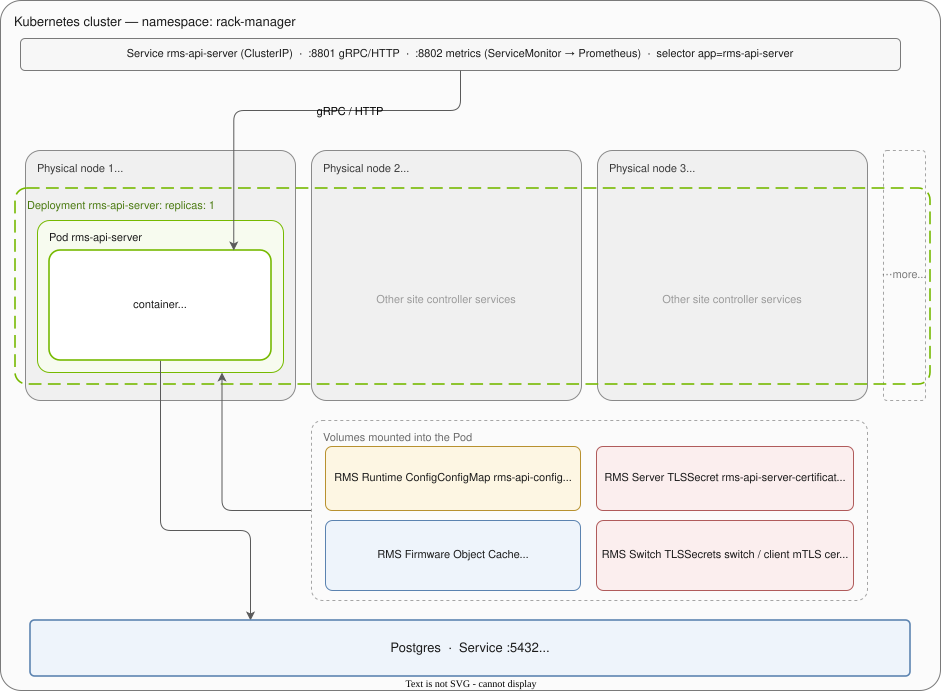
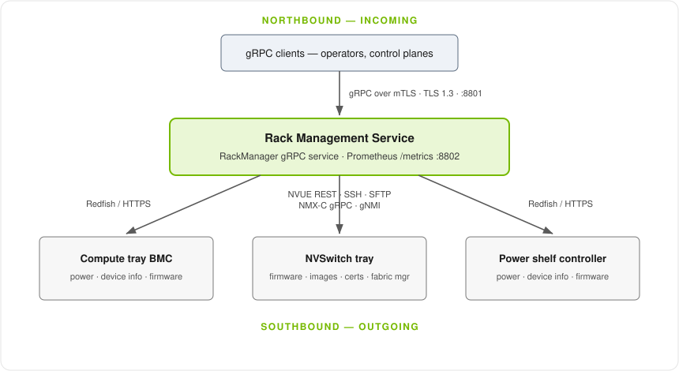

# External View

## Deployment Model

RMS ships as a Helm chart (`helm/`) that installs a single-replica `Deployment`
of the `rms-api-server` container, a ClusterIP `Service` in front of it, the
configuration and certificate material the container mounts, and an optional
PostgreSQL connection for the firmware catalog.

The Deployment is not pinned to a node. Its Pod is schedulable onto any node in
the cluster, and Kubernetes places the one replica on whichever node satisfies
the (optional) `apiServer.affinity` constraints. Everything else in the
diagram - the config `ConfigMap`, the API-server TLS `Secret`, the
switch/client mTLS `Secret`s, and the firmware volume - is mounted into that
Pod, and Postgres is reached over the network using a Service.

### Scalability

RMS scales horizontally at the *site controller* level, not at the replica
level. A data center runs many site controllers, each responsible for a slice
of the racks on the floor, and each site controller deploys its own independent
instance of RMS.

Nothing in the chart or the service ties instances together:

- The chart installs into its own namespace (`namespace: rack-manager` by
  default, overridable per install), so two site controllers can run the same
  chart without colliding.
- RMS has no cluster-wide registry or peer discovery. The rack map is built
  lazily from the requests an instance receives - `RackManager::with_rack_for_node`
  inserts a rack into its in-memory registry the first time a client addresses
  it - so an instance only ever knows about the racks its own clients target.
- Even if persisted in a shared database, the firmware apply history and catalog
  does not identify the instance of RMS that stored it.

Adding capacity therefore means adding site controllers and their RMS
instances, and partitioning racks between them. Two RMS instances must not
manage the same rack: they would not see each other's jobs or power-operation
locks (see below).

### Fault tolerance

`apiServer.replicaCount` defaults to `1`, and that is the supported
configuration. RMS inherits Kubernetes' recovery behavior, but it is not
highly available:

**What Kubernetes provides today**

- **Crash recovery.** If the container exits, the kubelet restarts it under the
  Deployment's restart policy.
- **Node failure recovery.** If the node hosting the Pod is lost, the Deployment
  controller reschedules the Pod onto another node - which is why the diagram
  draws the Deployment spanning every node.
- **Controlled rollout.** The Pod template carries a `checksum/config`
  annotation over the rendered `config.toml`, so a `helm upgrade` that changes
  configuration rolls the Deployment; RMS reads the mounted file only once at
  startup.
- **Durable firmware catalog.** The firmware bundle catalog and its apply
  history live in Postgres (`rack_firmware` and the apply-history table from
  `0001_rack_firmware.sql`), so they survive a Pod restart.

**What is lost on restart**

The orchestrator's runtime state is in-process memory, not Postgres:

- The rack registry is a `RwLock<HashMap<String, Arc<ManagedRack>>>` owned by
  `RackManager`.
- Job state is a `RwLock<JobStore>` inside `JobRegistry`, bounded by
  `max_tracked_jobs` (default 10,000) with terminal jobs evicted after
  `terminal_job_ttl_seconds` (default 24h).

A restart therefore drops every tracked job, including in-flight ones. Work
already dispatched to hardware - a firmware update running on a BMC, an image
install on a switch - continues on the device, but RMS loses the handle to it:
clients polling a job ID from before the restart get nothing back, and must
re-issue the operation and re-poll to resynchronize with hardware state.

There are also no liveness or readiness probes on the `rms-api-server`
container (only the standalone Postgres StatefulSet defines them), so a wedged
process that has not exited is not detected or restarted automatically.

**Why more than one replica is not supported**

Raising `replicaCount` above 1 would not give high availability; it would give
two independent, mutually blind instances of the same service:

- **Jobs are per-process.** The `Service` load-balances across Pods, so a client
  that starts a job on one replica may poll a replica that has never heard of
  that job ID.
- **Mutual exclusion is per-process.** Rack safety interlocks are in-memory
  primitives - the per-rack `power_operation_lock` (`tokio::sync::Mutex`) that
  serializes power operations, and the `RwLock` guarding each rack's node
  state. A second replica has its own copies, so both could drive conflicting
  operations against the same rack.
- **There is no leader election or shared job store.** The chart installs no
  lease, and the persistence layer stores only firmware objects and apply history.
  No shared state is stored that a second replica could use to observe the first one's jobs.
- **Firmware storage is not shared by default.** With
  `apiServer.firmwarePersistentVolumeClaim` unset, the firmware volume is a
  `hostPath` at `apiServer.firmwareStoragePath` (`/mnt/data`), which is
  node-local: a Pod rescheduled to another node comes up without the artifacts
  staged on the old one. Sites that need firmware artifacts to survive
  rescheduling should set `firmwarePersistentVolumeClaim` to a PVC backed by
  storage that is reachable from every node the Pod may land on.

### Summary

| Property | Status |
| --- | --- |
| Horizontal scale-out across racks | Yes - one RMS instance per site controller, 1:1 |
| Horizontal scale-out within one instance | No - single replica only |
| Restart / reschedule recovery | Yes - via the Deployment controller |
| In-flight jobs survive restart | No - job registry is in-memory |
| Firmware catalog survives restart | Yes - persisted in Postgres |
| Firmware artifacts survive rescheduling | Only with a shared PVC (`hostPath` default is node-local) |
| Health probes on the API server | Not defined in the chart |
| Leader election / active-passive failover | Not implemented |

## Northbound and southbound connections

RMS has one **northbound** (incoming client) interface - the `RackManager` gRPC
API - and several **southbound** (outgoing) interfaces it uses to reach hardware.

| Direction | Peer | Protocol(s) | Notes |
| --- | --- | --- | --- |
| Northbound | gRPC clients | gRPC over mTLS (TLS 1.3, rustls) | Single `RackManager` service; plaintext only in insecure dev mode. |
| Northbound | Prometheus | HTTP(S) `/metrics` | Independent listener; optional TLS reusing the gRPC server cert. |
| Southbound | Compute tray & power-shelf BMC | Redfish over HTTPS | Power, reset, device info, firmware inventory, multipart firmware upload. |
| Southbound | NVSwitch tray (NVUE/NVOS) | NVUE REST over HTTPS, SSH, SFTP | Switch firmware, system images, passwords, certificates, config. SFTP uploads switch OS images. |
| Southbound | NVSwitch tray (NMX-C) | NMX-C gRPC, gNMI | Scale-up fabric manager state and telemetry-interface control. |

To see a more detailed internal view of RMS layers and components, see [Internal View](internal_view.md).
