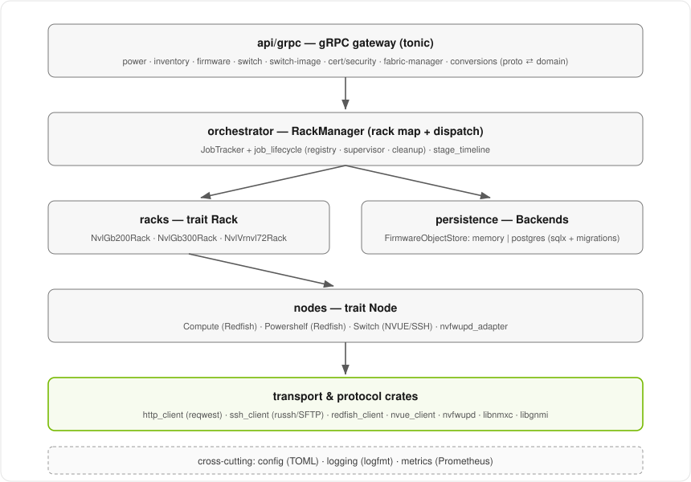

# Internal View

This page looks inside the service at its component layers, concurrency model, and
error and credential handling. For the external interfaces and protocols, see
[External View](external_view.md).

## Internal components

Internally, RMS is layered. Each layer has a single responsibility, and the node
and rack layers are trait-based so new hardware can be added without touching
existing code.

### API gateway (`api/grpc`)

Protocol-specific entry points. The `RackManager` gRPC service runs on the
configured port (default `8801`). Handlers translate protobuf requests and
coordinate domain or node operations. `conversions.rs` maps protobuf types to
and from domain types. Handler groups include `power_handlers`,
`inventory_handlers`,
`firmware_handlers`, `switch_handlers`, `switch_image_handlers`,
`switch_attestation_handlers`, `switch_certificate_handlers`,
`switch_security_handlers`, and `scaleupfabricmanager_handlers`. `server.rs`
sets up TLS/mTLS. See [Operations](../operations/overview.md) for the RPCs.

### Orchestrator (`orchestrator`)

`RackManager` owns the rack map (a `tokio::sync::RwLock`-protected collection) and
dispatches operations. Short operations (a power query) are awaited inline; long
operations (a firmware update or switch system-image install) are spawned as
tokio tasks and tracked by job ID.

The **job tracker** (`job_tracker.rs`, over the generic primitives in
`job_lifecycle/`) manages the async job lifecycle for both firmware and switch
OS-image work. It supports parent/child job hierarchies for batch operations, is
bounded by `max_tracked_jobs`, and evicts terminal (completed/failed) job records
after `terminal_job_ttl_seconds` via a background reaper. Batch workflows create
their top-level job first and dynamically attach admitted child jobs while that
job remains non-terminal. See
[Operations: the async job model](../operations/overview.md#the-async-job-model).

`stage_timeline.rs` breaks a long-running job into `Stage`s - the smallest
measurable unit of work a job progresses through (e.g. "stage image", "trigger
install", "wait for target steady state"). Each `Stage` has an immutable
`name` and imperative `description` fixed at construction, plus a `status`
(`queued` -> `running` -> `completed`/`failed`/`skipped`), timestamps, an
opaque `details` payload, and a `message` populated only on failure. A
`Stage` does not carry its own `job_id`: every stage in a timeline belongs
to the same job, so `job_id` - like the `node`/`rack` a timeline's stages
run against - is stored once, on the `StageTimeline` itself, rather than
duplicated per stage. A `StageTimeline` is built once, up front, from a job
type's predefined, ordered `Vec<Stage>` (e.g.
`switch_system_image_job_stages`), then driven forward purely by an
internal cursor: `start_current` marks the stage at the
cursor running, `complete_current` finishes it and advances the cursor, and
`fail_current` finishes it as failed without advancing - a job's failure is
always terminal, so the cursor simply stops there. Handlers never re-type a
stage's name at each call site; they just call these cursor methods in the
same order the job actually performs its work, and `to_json()` serializes the
whole planned pipeline (not just the stages reached so far) for status
polling. Each of the three cursor methods also centrally logs a generic
`"stage starting"` / `"stage completed"` / `"stage cancelled"` / `"stage failed"`
event (with `job_id`, `node`, `rack`, `stage`, and, for failures,
`error`), so handler call sites only need to add stage-specific context
beyond that.

A stage can end up `skipped` in two different situations, so a handler
never has to report a no-op as if it were real work: if a stage starts but
turns out to have nothing to do (e.g. no unused partition image to clean
up), the handler calls `skip_current` instead of `complete_current`; and
when a job exits early - a stage failed, was cancelled, or a precondition
check failed before any stage started - handlers call `skip_remaining`
once, right before sealing the job's terminal state, which moves every
still-`queued` stage to `skipped`. Both paths log `"stage skipped"` so the
timeline never shows unreached stages stuck at `queued` forever, or a
no-op stage misreported as `completed`.

### Racks (`racks`)

Trait-based. Each rack type (`NvlGb200Rack`, `NvlGb300Rack`, `NvlVrnvl72Rack`)
owns a map of `Arc<dyn Node>` and a node factory that constructs Compute, Switch,
or Powershelf nodes from the typed node identity in a request. Adding or removing
nodes invalidates the cached rack power-on order.

### Nodes (`nodes`)

Trait-based. Each node type encapsulates its management protocol behind the
`Node` trait:

- **Compute** (`compute_gb200_nvidia`, `compute_gb300_nvidia`,
  `compute_gb300_lenovo`, `compute_vrnvl72_nvidia`) - Redfish over HTTPS.
- **Powershelf** (`powershelf_gb200_liteon`, `powershelf_gb200_delta`,
  `powershelf_gb300_liteon`, `powershelf_gb300_delta`) - Redfish over HTTPS; the
  Delta shelves additionally use the embedded nvfwupd workflow.
- **Switch** (`switch_gb200_nvidia`, `switch_gb300_nvidia`) - NVUE REST plus
  SSH/SFTP, including NVUE-based SPDM attestation evidence collection. NMX-C
  gRPC and gNMI provide fabric and telemetry operations.

Adding a new node type means implementing the `Node` trait - no changes to
existing code. Adding a new rack type means implementing the `Rack` trait with its
own node factory. See [Development: adding hardware support](../reference/development.md#adding-hardware-support).

The **NVFWUPD adapter** (`nodes/nvfwupd_adapter.rs`) converts RMS node
credentials, firmware requests, outcomes, task status, and activation requests
into the embedded [`nvfwupd`](../reference/crates.md#nvfwupd) workflow API. PLDM
firmware-package parsing and switch CPLD `.vme` extraction live in the nvfwupd
crate.

### Transport and protocol crates (`transport`, workspace crates)

- `transport/http_client.rs` wraps `reqwest` for async Redfish/NVUE HTTP (GET,
  POST/PATCH JSON, multipart and raw file upload).
- `transport/ssh_client.rs` (and the `transport/ssh/` module) wraps `russh` for
  async SSH exec and SFTP file transfers, with per-step and overall upload
  timeouts.
- [`redfish_client`](../reference/crates.md#redfish_client) - RMS-focused Redfish
  operations (power/reset, MNNVLink topology discovery, multipart firmware
  upload).
- [`nvue_client`](../reference/crates.md#nvue_client) - the async NVUE/NVOS REST
  client and API models used by the switch nodes.
- [`nvfwupd`](../reference/crates.md#nvfwupd) - the embedded firmware-update workflow
  library (and standalone CLI).
- `libnmxc` - the NMX-C gRPC client and switch TLS material store for the scale-up
  fabric manager.
- `libgnmi` - a gNMI client for switch telemetry/config connectivity checks.

### Persistence layer (`persistence`)

A swappable, per-domain storage abstraction. The `FirmwareObjectStore` trait is
implemented by both a `memory` backend and a `postgres` backend (sqlx, with
compile-time-embedded migrations); the active backend is selected at startup from
`[postgres] db_url` / `DATABASE_URL`. Only workflow data is persisted - firmware
objects, cached artifact metadata, and apply history - never rack topology. See
[Development: adding a persistence domain](../reference/development.md#adding-a-persistence-domain).

Switch SPDM attestation evidence collection (see
[Switch management](../operations/switch-management.md#spdm-attestation-evidence))
is stateless in RMS: it holds no lock and persists nothing. The caller (NICo)
owns job state, quarantine, and retry decisions.

### Cross-cutting

- **config** - all runtime configuration is loaded from a single TOML file (via
  `figment`/`toml`) and validated at startup. See [Configuring RMS](../configuration/configuring-rms.md).
- **logging** - structured logging in logfmt via `tracing` / `tracing-subscriber`.
- **metrics** - a dedicated Prometheus `/metrics` listener (default `8802`),
  independent of the gRPC port, optionally served over TLS.

## Concurrency and scale

RMS is designed to manage **10k+ nodes** concurrently. Every I/O operation is
async: a firmware update that polls a BMC every 5 seconds does
`tokio::time::sleep(5s).await` between polls, yielding its worker thread to serve
other work. Thousands of concurrent firmware jobs run as lightweight async tasks
on a fixed pool of OS threads (typically the CPU core count), not thousands of
blocked threads. The process uses the **mimalloc** allocator for low cross-thread
contention under this fan-out workload.

Key concurrency primitives:

- **Per-node serialization** - each node holds a `tokio::sync::Mutex` around its
  transport client. Operations on different nodes run fully in parallel;
  operations on the same node serialize, matching the fact that a BMC processes
  one Redfish request at a time.
- **Rack map** - a `tokio::sync::RwLock`; find/list reads are concurrent, add/remove
  writes are exclusive.
- **Job tracking** - concurrent reads of async job status; one `tokio::spawn` per
  node in a batch (a 36-node batch is 36 async tasks sharing a handful of OS
  threads).
- **Graceful shutdown** - a `CancellationToken` is propagated to all spawned
  tasks; on `SIGINT`/`SIGTERM` RMS drains in-flight jobs before exiting.

## Error handling

All fallible operations return `Result<T, RmsError>`. `RmsError` carries an
`ErrorCode` that the gRPC gateway maps to a gRPC status code:

| `ErrorCode` | gRPC Status |
| --- | --- |
| `NotFound` | `NOT_FOUND` |
| `AlreadyExists` | `ALREADY_EXISTS` |
| `InvalidArgument` | `INVALID_ARGUMENT` |
| `Timeout` | `DEADLINE_EXCEEDED` |
| `FailedPrecondition` | `FAILED_PRECONDITION` |
| `Unavailable` | `UNAVAILABLE` |
| `Unimplemented` | `UNIMPLEMENTED` |
| `Internal` | `INTERNAL` |

## Credentials

Credentials (username/password) are passed directly in gRPC requests at
node-creation time and held on the ephemeral node using zero-on-drop secure
strings (the `secrecy` crate). RMS uses no external credential provider and does
not persist device credentials.
